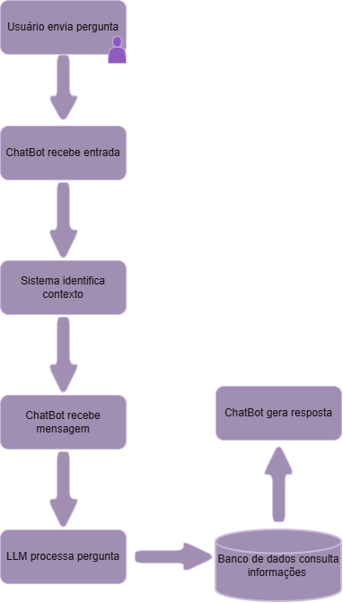

# Integrantes: 
- Anna Cecilia Guimarães Maiques Lima de Carvalho -RM: 570955
- Caio Eguia Ceschini -RM: 573847
- Gabriel Henrique S. de Melo Rodrigues - RM: 573093
- Fernando Bonfim Hoefle - RM: 569920
- Arthur de Oliveira Carvalho - RM: 573499

# Problema

Condomínios que possuem carregadores para veículos elétricos enfrentam dificuldades no gerenciamento de uso, controle de consumo energético, agendamento e cobrança dos usuários.
O nosso projeto propõe um chatbot inteligente para auxiliar síndicos e moradores no gerenciamento de carregadores elétricos em condomínios.

# O que o chat bot faz?

- Consulta de consumo energético
- Reserva de carregadores
- Verificação de disponibilidade
- Consulta de cobranças
- Alertas de falhas técnicas

# Tecnologias Utilizadas

OpenAI API: IA

Python: Backend 

Draw.io: Fluxograma 

# Tecnologia IA utilizada:

A OpenAI API foi escolhida por causa da sua capacidade de compreender linguagem natural e gerar respostas contextualizadas. 
O Google Colab foi usado para fazer o modelo teste.

# Fluxograma

# Modelo de Teste

https://colab.research.google.com/drive/1qYC9qGgdmIeXw6Agd3nHmMtVymeMBIB7?usp=sharing 
